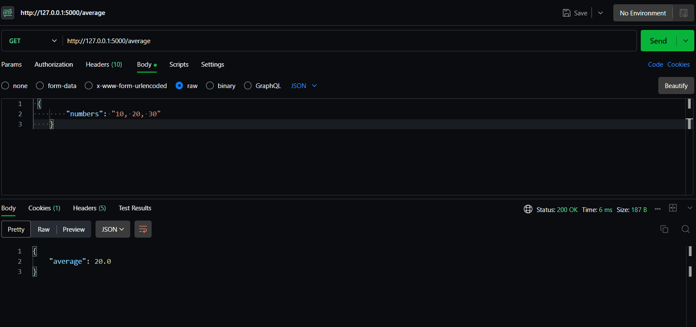

# Flask Average Calculator

A simple web application built with Flask to calculate the average of comma-separated numbers.

**Postman Output**


**Web Output**


## How to Run

```bash
# Clone this repository
git clone https://github.com/subhash-kr0/2104920100107.git
cd AverageCalculator

# Create a virtual environment
python -m venv venv
source venv/bin/activate  # On Windows: venv\Scripts\activate

# Install dependencies
pip install -r requirements.txt

# Run the app
python run.py
